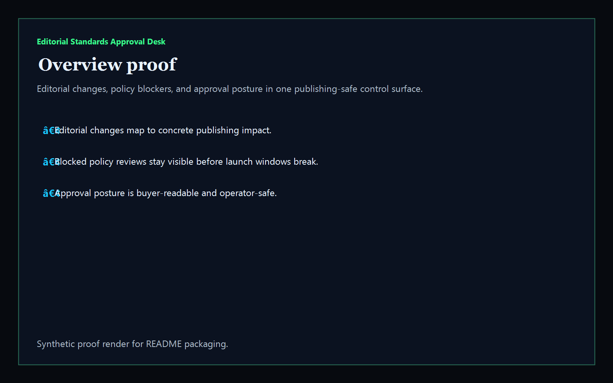
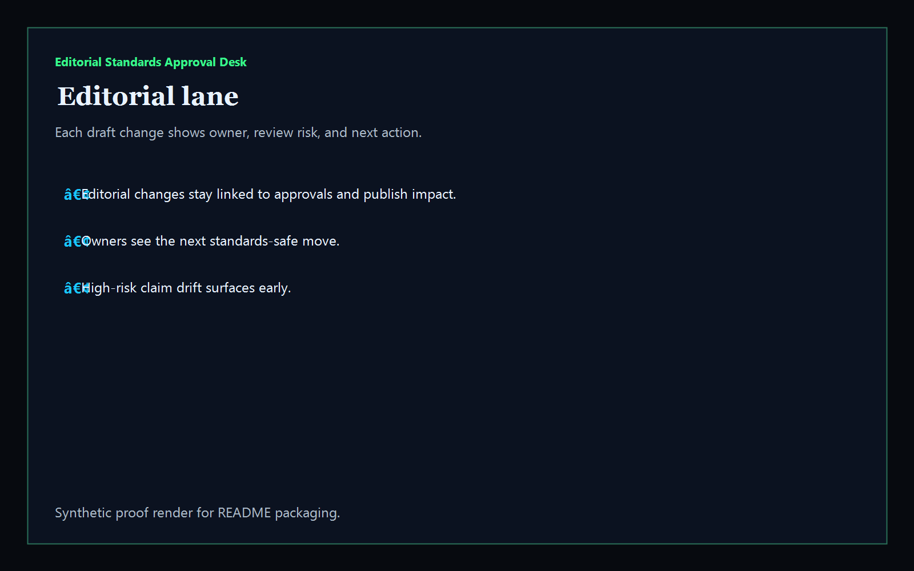
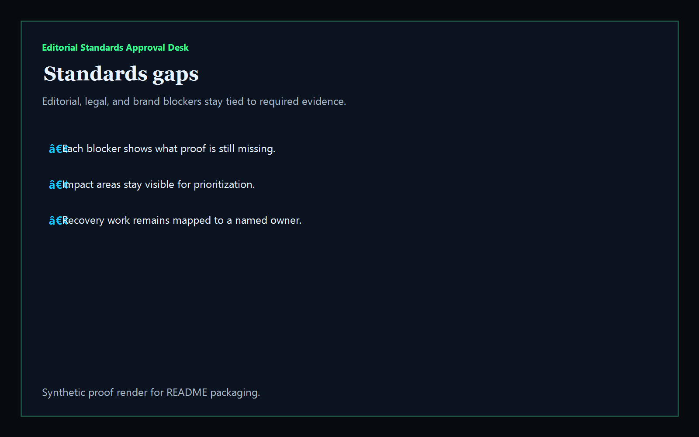
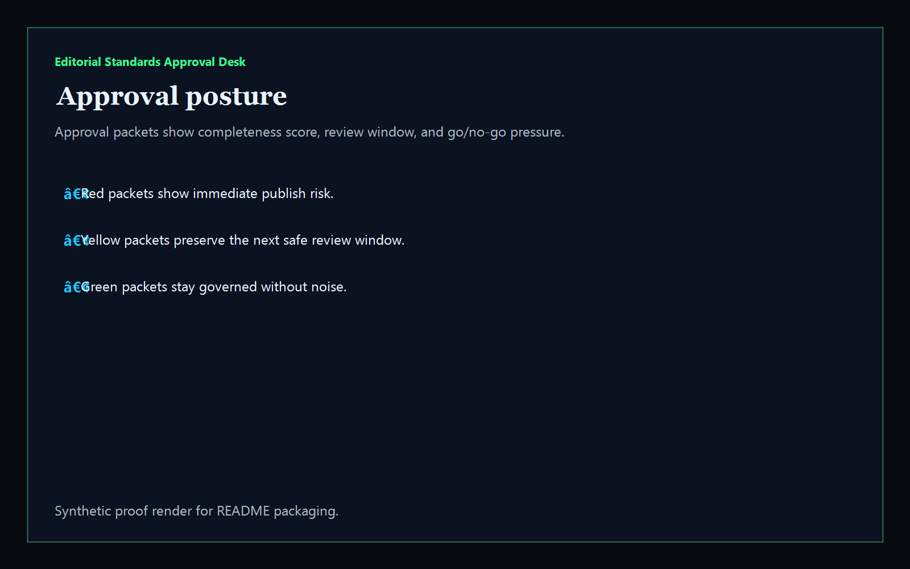

# Editorial Standards Approval Desk

[](https://github.com/mizcausevic-dev/editorial-standards-approval-desk/actions/workflows/ci.yml)
[](./LICENSE)
[](./.github/dependabot.yml)
[](https://github.com/mizcausevic-dev/editorial-standards-approval-desk/actions/workflows/pages.yml)

TypeScript operator surface for editorial standards routing, copy-policy blockers, and approval-safe publishing posture.

## Why this exists

- Publishing teams lose trust when standards review, legal disclaimers, and brand approvals live in separate systems.
- Editorial teams need a clear view of which claims, disclosures, style guides, and citation proofs still block the next publish window.
- Media / Publishing buyers care whether a page, email, or campaign can launch safely without fragmenting reviewer notes, proof packets, or compliance steps.
- Operator tooling should turn copy chaos into governed review lanes, ownership, and measurable approval readiness.

## Why this matters (KG Embedded tie-back)

This repo demonstrates the editorial-standards governance primitive for Media / Publishing buyers: draft changes, policy blockers, and approval posture tied into one operator surface. A B2B SaaS buyer would care because content, review, and reporting data often need to surface inside customer-facing products without exposing unsafe write paths or fragmented approval evidence. Kinetic Gain Embedded extends this into security-first in-product analytics for publishing, editorial, and revenue workflows, see [kineticgain.com/embedded](https://kineticgain.com/embedded).

## Routes

- `/`
- `/editorial-lane`
- `/standards-gaps`
- `/approval-posture`
- `/verification`
- `/docs`

## API

- `/api/dashboard/summary`
- `/api/editorial-lane`
- `/api/standards-gaps`
- `/api/approval-posture`
- `/api/verification`
- `/api/sample`

## Screenshots






## Local Development

```powershell
cd editorial-standards-approval-desk
npm install
npm run dev
```

Open:
- [http://127.0.0.1:5545/](http://127.0.0.1:5545/)
- [http://127.0.0.1:5545/editorial-lane](http://127.0.0.1:5545/editorial-lane)
- [http://127.0.0.1:5545/standards-gaps](http://127.0.0.1:5545/standards-gaps)
- [http://127.0.0.1:5545/approval-posture](http://127.0.0.1:5545/approval-posture)
- [http://127.0.0.1:5545/verification](http://127.0.0.1:5545/verification)

## Validation

- `npm run build`
- `npm run test`
- `npm run coverage`
- `npm run demo`
- `npm run smoke`
- `npm run prerender`
- `npm run render:assets`

## Production status

| Aspect | Status |
|--------|--------|
| CI | Node 20 + 22 matrix — lint · typecheck · coverage · build · demo · smoke · `npm audit` ([workflow](./.github/workflows/ci.yml)) |
| Test coverage | `src/services/` coverage gate maintained via `vitest` |
| License | [AGPL-3.0-or-later](./LICENSE) |
| Dependencies | Dependabot weekly (npm + GitHub Actions); `npm audit --audit-level=high` in CI |
| Data handling | Synthetic, non-sensitive editorial packets only. No live CMS drafts, legal notes, or reviewer records. |
| Deploy | Static prerender → **https://editorial.kineticgain.com/** (GitHub Pages, [pages workflow](./.github/workflows/pages.yml)) |

## Docs

- [Architecture](./docs/architecture.md)
- [Origin](./docs/ORIGIN.md)
- [Kinetic Gain Embedded tie-back](./docs/KINETIC_GAIN_EMBEDDED.md)
- [Changelog](./CHANGELOG.md)

## Part of the Kinetic Gain Suite

Operator surface in the [Kinetic Gain Suite](https://suite.kineticgain.com/) — a portfolio of buyer-readable control planes spanning security posture, compliance evidence, data-platform governance, FinOps, and operator workflows. Apex: [kineticgain.com](https://kineticgain.com/).

## Related surfaces

- [**`rights-window-release-planner`**](https://github.com/mizcausevic-dev/rights-window-release-planner) — rights sequencing and release governance
- [**`campaign-taxonomy-governor`**](https://github.com/mizcausevic-dev/campaign-taxonomy-governor) — campaign naming and reporting discipline
- [**`booking-disruption-command-center`**](https://github.com/mizcausevic-dev/booking-disruption-command-center) — live operations disruption handling
